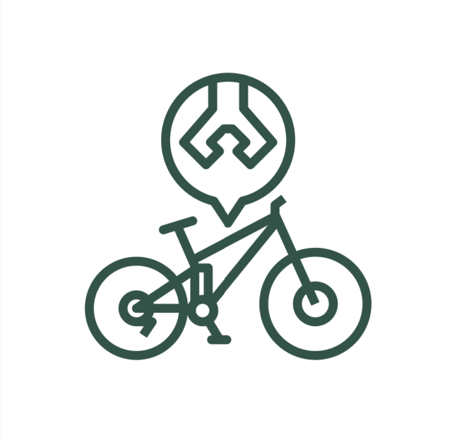

# Pedal Prep

## Team Name:  Pedal Prep

## Team Members  
Lara Kawasme (solo project)

## Mission Statement  
Encourage cyclists to ride safely and confidently by simplifying bike maintenance and pre-ride preparation through easy-to-use, customizable checklists and timely reminders.

## Problem Statement  
Many cyclists, especially casual and new riders, struggle to keep up with regular bike maintenance and pre-ride checks. Without simple and accessible tools to track these tasks, riders risk unsafe conditions, unexpected breakdowns, and costly repairs. There is lots of information online but it can quickly be overwhelming to know what you need to know. This lack of guidance reduces confidence and can discourage regular cycling, limiting the benefits of riding for fitness, transportation, and enjoyment.
So, how can we design an intuitive tool that simplifies bike maintenance and pre-ride preparation to help riders feel confident, safe, and motivated to cycle regularly?
