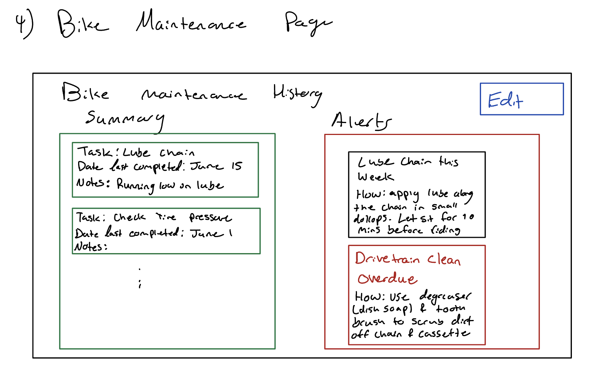

# Pedal Prep – Project Specification
This describes the design probelm and the design solution

## Problem
Cycling offers a wide range of personal, societal, and environmental benefits. Cycling promotes cardiovascular health, muscle endurance, reduces carbon emissions, and supports sustainable urban mobility. However for many beginner and casual riders, safety concerns, such as lack of mechanical confidence, remain as barriers. A study by Plowden and Parkin (2023) found that mechanical repairs were a barrier to cycling, with participants fearing that mechanical failures could render their bike unusable. Repair costs were also cited as deterrents. Without accessible and structured tools for bike maintenance and pre-ride preparation, riders are often left feeling uncertain and unprepared, thus lowering their confidence and limiting cycling’s everyday use.

Essential habits such as checking tire pressure, brake responsiveness, and chain lubrication are often overlooked until larger, more expensive issues arise. Unlike cars, bikes don’t have a dashboard that reminds them of what needs attention. Regular bike service not only ensures the bike operates smoothly but also significantly reduces the risk of accidents caused by mechanical failures, thus making it a critical component of cycling safety (Fieldsend, 2025). While there is plenty of information online about bike maintenance, it can be fragmented, overly technical, or too generalized to support day-to-day riding. Thus, without an easy and simple way to learn about and track bike maintenance tasks, many people are discouraged from riding regularly and missing out on the benefits cycling has to offer.

Sources:
Fieldsend, J. (2025, June 25). The importance of regular bike maintenance: Tips from UK Mechanics. bikebook. https://bikebook.co.uk/article/regular-bike-servicing-tips

Plowden, E., & Parkin, J. (2023). Maintenance of action: A qualitative study of cycle commuting adoption resulting from a cycle loan scheme. Journal of Transport &amp; Health, 30, 101610. https://doi.org/10.1016/j.jth.2023.101610
https://www.sciencedirect.com/science/article/pii/S2214140523000464

## Solution

Pedal Prep is an application that guides cyclists through pre-ride safety checks, routine maintenance, and repair tracking. The app provides video instructions, maintenance reminders, and a record of past services.

### 1. Home Screen
**Purpose:** This will act as the user’s dashboard. It will summarize alerts, have a button to the ride prep checklist, have a button to view maintenance history, and a button to add bike.

**Key elements and algorithmic functionality:**
- Greeting such as “Welcome” or “Good evening!”
- Page will be blank if there is no bike yet and will have a button to add a bike
- Bike status summary:
  - Last tire pressure check: 10 days ago
  - Last time chain was lubed: yesterday
- Buttons:
  - A button to begin the pre-ride checklist
  - A button to go to the maintenance history page
  - Add new bike (if none exists)
- Maintenance alerts:
  - Lube chain this week
  - Check brakes this week

---

### 2. Pre-ride Checklist Page
**Purpose:** This page will take users through a pre-ride checklist to ensure safety before riding.

**Key elements and algorithmic functionality:**
- Users have to check off item once completed
  - Implemented with a checkbox
- Users can select which checklist items appear and in what order
  - Default checklist will include:
    - Test brakes
    - Inspect chain for dryness
    - Check shifting is smooth
    - Check tire pressure
- Once checklist is completed, the app will:
  - Record completion timestamp for the bike log
  - Update relevant last complete tasks
  - Go back to the home page
- This will be a customizable page. Users can choose to edit what they want on their screen
- Errors:
  - If user doesn’t complete a task, it will alert the user:
    - “You skipped a safety step. Are you sure you want to continue?”
    - Then prompt with the option to go back or continue

---

### 3. Maintenance History Page
**Purpose:** This will be the page to see all completed tasks and upcoming tasks.

**Key elements and algorithmic functionality:**
- Section for each type of maintenance activity
  - Includes task name
  - Date completed
  - Notes:
    - I would like to keep full history for a year but I am unsure how much more work that will be for this project so I will not include in MVP
    - Thus, each item will just have date completed and any notes in text
- Will calculate reminders based on time
  - Ideally I’d like this to be based off distance but that would require riders to upload their distances, types of ride, etc., which adds complexity
- Will show overdue items in red
- Will show upcoming tasks in a neutral colour (grey or soft green)
- Users can select an item and complete the task
- App will provide basic instructions on how to complete the task

---

### 4. Add Bike Page
**Purpose:** To add a new bike to keep track of!

**Key elements and algorithmic functionality:**
- Accessed from the home page
- User inputs the type of bike, brand, and model (if they know)
  - The MVP will only support road/commuter bikes for simplicity (no bikes with front & rear suspension)
  - Dropdown for type of bike:
    - Road, commuter
  - Brand: text input
  - Model: optional text input
- Once complete, takes user back to homepage
- Errors:
  - If they try to add the bike without filling any of the fields it will give an error: “Please complete bike information”

